```
## Warning: package 'RJSONIO' was built under R version 2.15.3
```

```
## Warning: package 'XML' was built under R version 2.15.3
```


<!-- impact_figure(tabular_data[1]) -->

# Impact report for rOpenSci packages (generated March 30th, 2013)

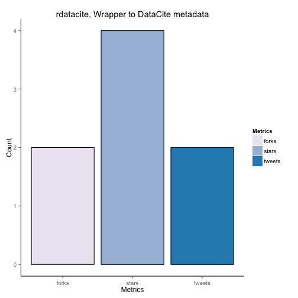 

**Legend**  rdatacite (Wrapper to DataCite metadata) released in 2011 was discussed by the public 2 times. This item has 4 stars on GitHub. That's better than 83 percent of items added to GitHub in the same year. The item has 2 forks. This is better than 86 percent of GitHub repositories of the same age

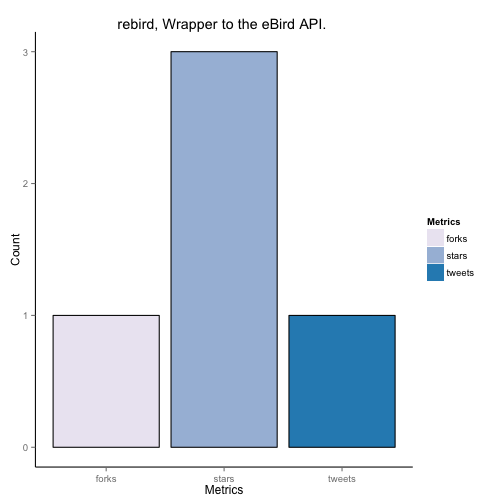 

**Legend**  rebird (Wrapper to the eBird API. ) released in 2012 was discussed by the public 1 times. This item has 3 stars on GitHub. That's better than 85 percent of items added to GitHub in the same year. The item has 1 forks. This is better than 84 percent of GitHub repositories of the same age

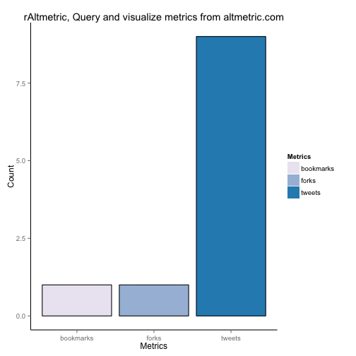 

**Legend**  

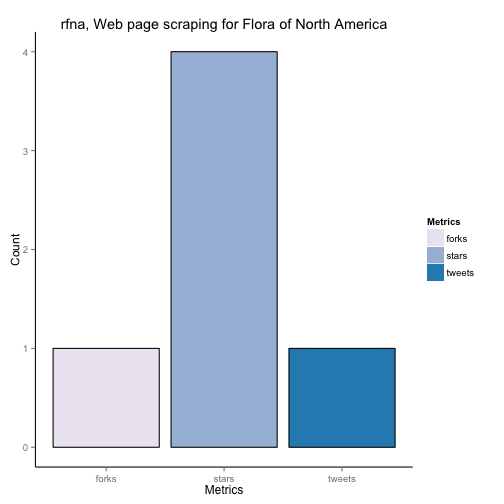 

**Legend**  rfna (Web page scraping for Flora of North America) released in 2011 was discussed by the public 1 times. This item has 4 stars on GitHub. That's better than 83 percent of items added to GitHub in the same year. The item has 1 forks. This is better than 81 percent of GitHub repositories of the same age

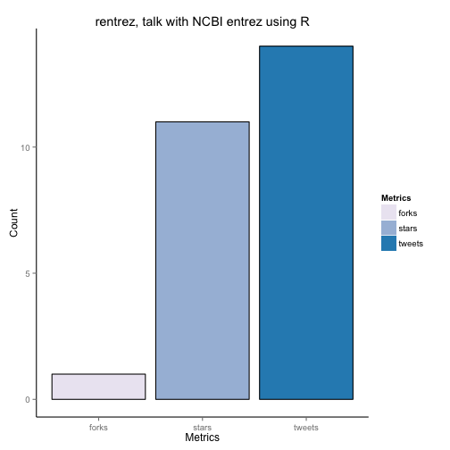 

**Legend**  rentrez (talk with NCBI entrez using R) released in 2012 was discussed by the public 14 times. This item has 11 stars on GitHub. That's better than 93 percent of items added to GitHub in the same year. The item has 1 forks. This is better than 84 percent of GitHub repositories of the same age

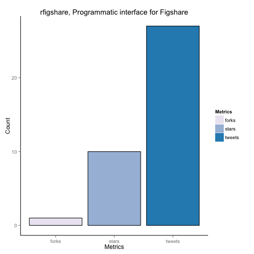 

**Legend**  rfigshare (Programmatic interface for Figshare) released in 2012 was discussed by the public 27 times. This item has 10 stars on GitHub. That's better than 93 percent of items added to GitHub in the same year. The item has 1 forks. This is better than 84 percent of GitHub repositories of the same age

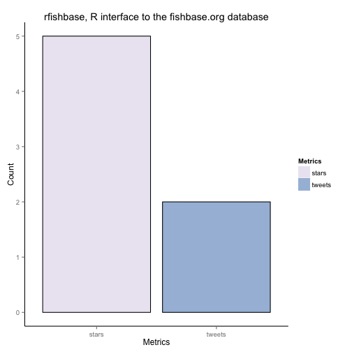 

**Legend**  

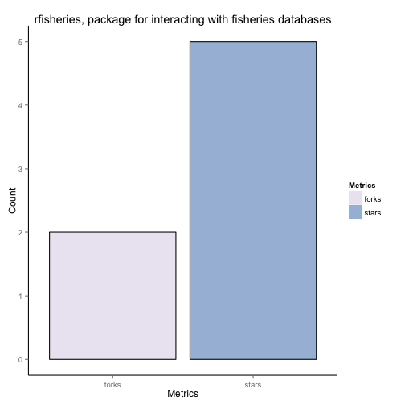 

**Legend**  

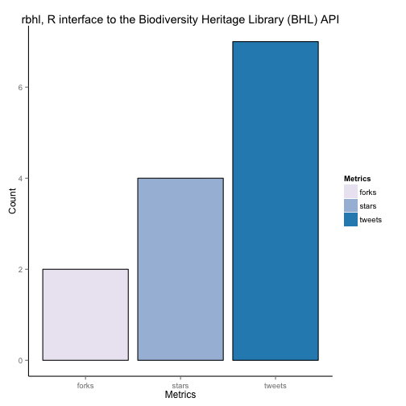 

**Legend**  rbhl (R interface to the Biodiversity Heritage Library (BHL) API) released in 2011 was discussed by the public 7 times. This item has 4 stars on GitHub. That's better than 83 percent of items added to GitHub in the same year. The item has 2 forks. This is better than 86 percent of GitHub repositories of the same age

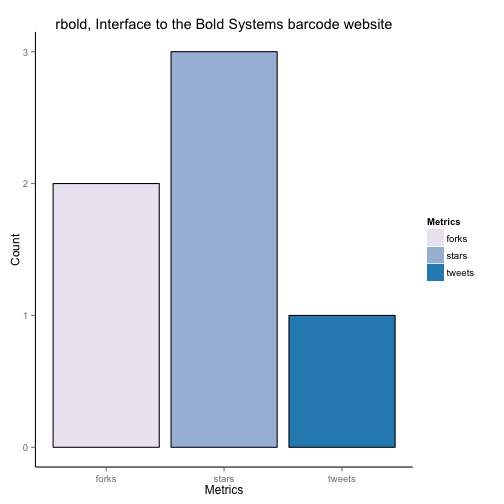 

**Legend**  rbold (Interface to the Bold Systems barcode website) released in 2011 was discussed by the public 1 times. This item has 3 stars on GitHub. That's better than 80 percent of items added to GitHub in the same year. The item has 2 forks. This is better than 86 percent of GitHub repositories of the same age

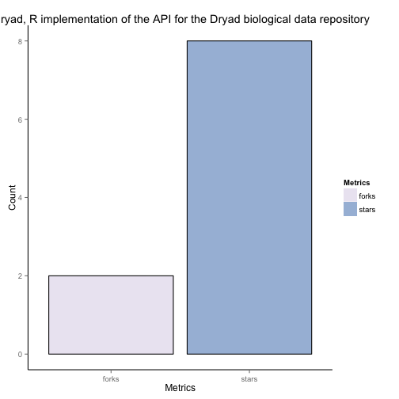 

**Legend**  

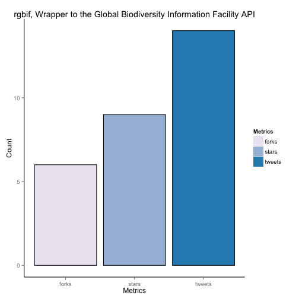 

**Legend**  rgbif (Wrapper to the Global Biodiversity Information Facility API) released in 2011 was discussed by the public 14 times. This item has 9 stars on GitHub. That's better than 91 percent of items added to GitHub in the same year. The item has 6 forks. This is better than 93 percent of GitHub repositories of the same age

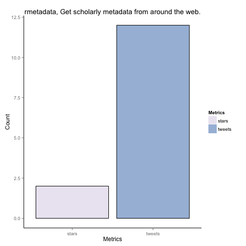 

**Legend**  

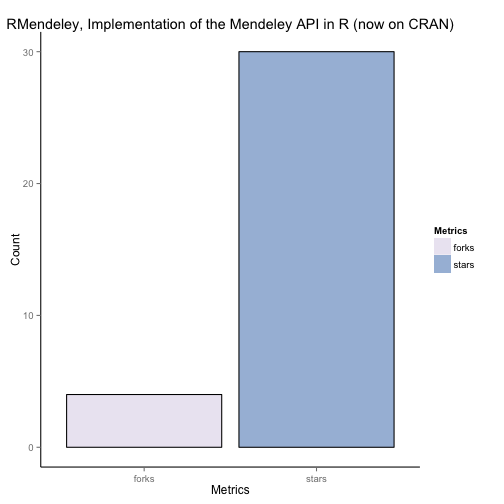 

**Legend**  

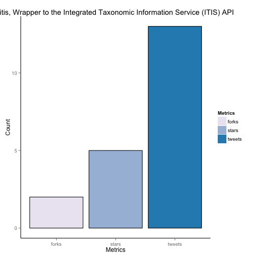 

**Legend**  ritis (Wrapper to the Integrated Taxonomic Information Service (ITIS) API) released in 2011 was discussed by the public 13 times. This item has 5 stars on GitHub. That's better than 84 percent of items added to GitHub in the same year. The item has 2 forks. This is better than 86 percent of GitHub repositories of the same age

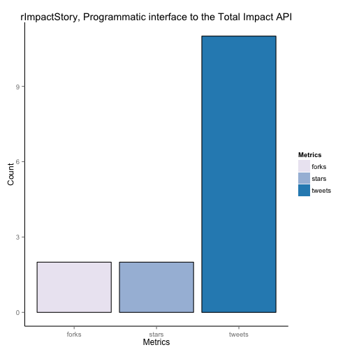 

**Legend**  rImpactStory (Programmatic interface to the Total Impact API) released in 2012 was discussed by the public 11 times. This item has 2 stars on GitHub. That's better than 80 percent of items added to GitHub in the same year. The item has 2 forks. This is better than 89 percent of GitHub repositories of the same age

 

**Legend**  rImpactStory (Programmatic interface to the Total Impact API) released in 2012 was discussed by the public 11 times. This item has 2 stars on GitHub. That's better than 80 percent of items added to GitHub in the same year. The item has 2 forks. This is better than 89 percent of GitHub repositories of the same age

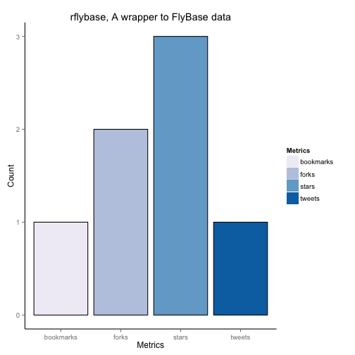 

**Legend**  rflybase (A wrapper to FlyBase data) released in 2011 was discussed by the public 1 times. This item has 3 stars on GitHub. That's better than 80 percent of items added to GitHub in the same year. The item has 2 forks. This is better than 86 percent of GitHub repositories of the same age

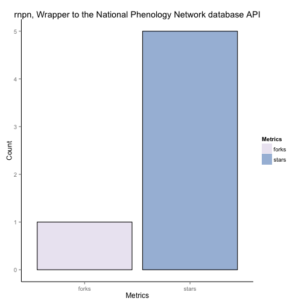 

**Legend**  


