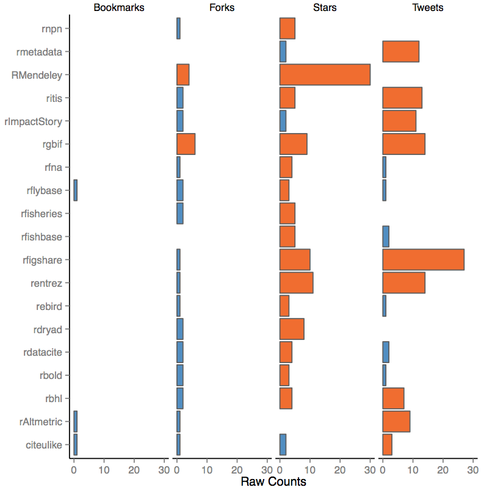

# ImpactStory report for rOpenSci

Code + template to generate an ImpactStory summary for your GitHub repositories. 

1. Log into ImpactStory and create a report by adding your GitHub username or GitHub organization's username. 
2. Copy the report ID
3. Edit the top of [`impact_story.R`](https://github.com/ropensci/ImpactReport/blob/master/impact_report.R) and add the ID
4. knit [`report.Rnw`](https://github.com/ropensci/ImpactReport/blob/master/report.Rnw) to generate this [pdf](https://github.com/ropensci/ImpactReport/blob/master/report.pdf?raw=true).

# The Report

Here's an impact report for some of the more complete rOpenSci packages. It's easy to see that not many are being bookmarked on Delicious (not surprising). It's also cool to see packages that have wider appeal (like GBIF, figshare, and Mendeley) are showing up consistently across different metrics.

## Contributions
Please feel free to fork and submit other templates.

## Todo
Make other general templates that can handle full impact reports with other products. One could easily generate an up to date report and append it to a cv.
